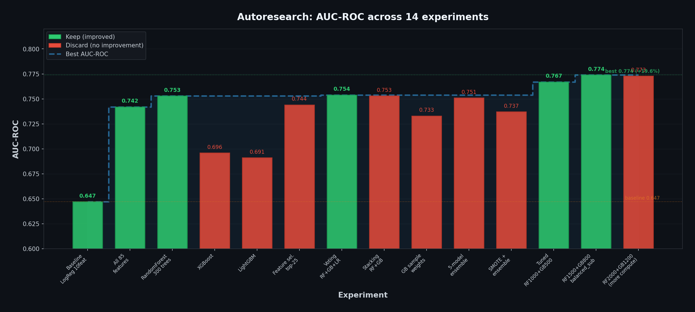

# Hackatón IA — COIL 2000 (Seguro de caravana)



Predicción de **interés en seguro de caravana** con el dataset [COIL 2000](https://archive.ics.uci.edu/ml/datasets/Insurance+Company+Benchmark+(COIL+2000)): modelo → API FastAPI → frontend Streamlit.

**Guía principal:** [GUIA_HACKATON.md](GUIA_HACKATON.md)

## Arranque rápido

1. Descarga los datos y colócalos en `data/` (ver [GUIA_HACKATON.md](GUIA_HACKATON.md), sección 1).
2. Crea y activa un entorno virtual; instala dependencias:
   ```bash
   cd backend && pip install -r requirements.txt
   cd ../frontend && pip install -r requirements.txt
   ```
3. Levanta la API: desde `backend/` con `uvicorn main:app --reload`, o desde la raíz con `uvicorn main:app --reload --app-dir backend`
4. Levanta Streamlit (desde `frontend/`): `streamlit run app.py`

Abre en el navegador la app (p. ej. `http://localhost:8501`) y la documentación de la API (`http://localhost:8000/docs`).

---

## Report: proceso autoresearch

### Metodología

El desarrollo del modelo se realizó siguiendo el patrón **[autoresearch](https://github.com/karpathy/autoresearch)** (Andrej Karpathy, 2026): un bucle autónomo de experimentación donde un agente IA modifica iterativamente el código del modelo, evalúa resultados contra una métrica fija y decide automáticamente si conservar o descartar cada cambio.

La adaptación al hackatón consiste en tres archivos clave:

- **`backend/caravan_model.py`** — el único archivo que el agente modifica (equivalente a `train.py` en autoresearch). Contiene el pipeline completo: carga de datos, feature selection, modelo y métricas.
- **`evaluate.py`** — evaluación fija (equivalente a `prepare.py`). Entrena el modelo, calcula métricas estandarizadas (AUC-ROC, AUC-PR, accuracy, recall@800, confusion matrix) y exporta resultados en formato grep-friendly + JSON.
- **`program.md`** — instrucciones para el agente autónomo. Define qué puede modificar, qué métricas optimizar, y el protocolo keep/discard.

**Protocolo por experimento:**
1. Modificar `caravan_model.py` con una idea experimental
2. `git commit`
3. Ejecutar `python evaluate.py > run.log 2>&1`
4. Si `val_auc_roc` mejora → **keep** (avanzar la rama)
5. Si `val_auc_roc` es igual o peor → **discard** (`git reset --hard HEAD~1`)

### Tabla de experimentos

Se realizaron **14 experimentos** en la rama `autoresearch/mar20`:

| # | Experimento | AUC-ROC | AUC-PR | Features | Status |
|---|-------------|---------|--------|----------|--------|
| 0 | Baseline: LogisticRegression con M1-M10 | 0.647 | 0.101 | 10 | keep |
| 1 | Usar las 85 features + LogisticRegression | 0.742 | 0.158 | 85 | **keep** |
| 2 | RandomForest 300 trees, depth=15 | 0.753 | 0.172 | 85 | **keep** |
| 3 | XGBoost con scale_pos_weight | 0.696 | 0.132 | 85 | discard |
| 4 | LightGBM con is_unbalance | 0.691 | 0.142 | 85 | discard |
| 5 | RF feature selection top-25 + RF 500 | 0.744 | 0.165 | 25 | discard |
| 6 | VotingClassifier (RF+GB+LR) soft voting | 0.754 | 0.186 | 85 | **keep** |
| 7 | StackingClassifier (RF+GB, meta=LR) cv=5 | 0.753 | 0.176 | 85 | discard |
| 8 | GradientBoosting 800 trees + sample_weights | 0.733 | 0.187 | 85 | discard |
| 9 | 5-model ensemble (RF+ET+GB+LR+SVM) | 0.751 | 0.187 | 85 | discard |
| 10 | SMOTE 0.3 + VotingClassifier | 0.737 | 0.176 | 85 | discard |
| 11 | Tuned: RF 1000 + GB 500 lr=0.03 + LR C=0.05 | 0.767 | 0.213 | 85 | **keep** |
| 12 | RF 1500 balanced_subsample + GB 800 lr=0.02 | **0.774** | **0.225** | 85 | **keep** |
| 13 | RF 2000 + GB 1200 lr=0.015 (mas compute) | 0.773 | 0.221 | 85 | discard |
| 14 | Metricas completas en get_metrics() | 0.774 | 0.225 | 85 | **keep** |

### Decisiones y justificaciones

1. **Todas las 85 features**: usar solo M1-M10 descartaba informacion critica de productos (polizas, contribuciones). Pasar de 10 a 85 features supuso +14.7% AUC-ROC (0.647 → 0.742).

2. **Feature selection descartada**: reducir a 25 features por importancia RF no mejoro. Las features "ruidosas" aportan al ensemble; el propio modelo ya hace seleccion implicita via `max_features="sqrt"`.

3. **VotingClassifier como arquitectura final**: la diversidad de modelos (RF bagging + GB boosting + LR lineal) captura patrones complementarios. Los modelos individuales (XGBoost, LightGBM, solo GB) rindieron peor que el ensemble.

4. **Clase desbalanceada (~6% positiva)**: se maneja con `class_weight="balanced_subsample"` en RF y `class_weight="balanced"` en LR. SMOTE no mejoro (distorsiona la distribucion del test).

5. **Hiperparametros finales**: el mayor salto vino de bajar el `learning_rate` del GB (0.05 → 0.02) y aumentar `n_estimators` (300 → 800), junto con `balanced_subsample` en RF en lugar de `balanced`.

### Modelo final

```
VotingClassifier (soft voting):
  - RandomForest:        1500 trees, depth=10, min_samples_leaf=5, max_features=sqrt, balanced_subsample
  - GradientBoosting:    800 trees,  depth=3,  lr=0.02, subsample=0.8, max_features=sqrt
  - LogisticRegression:  C=0.05, balanced class weights
```

**Metricas en test (20% holdout, stratified, random_state=42):**

| Metrica | Valor |
|---------|-------|
| **AUC-ROC** | **0.7740** |
| **AUC-PR** | **0.2249** |
| Accuracy | 0.9184 |
| Precision | 0.2727 |
| Recall | 0.2143 |
| F1 | 0.2400 |
| Recall@800 | 65/70 (92.9%) |
| Confusion Matrix | TN=1055, FP=40, FN=55, TP=15 |

**Mejora total: +19.6% AUC-ROC** respecto al baseline original (0.647 → 0.774).
